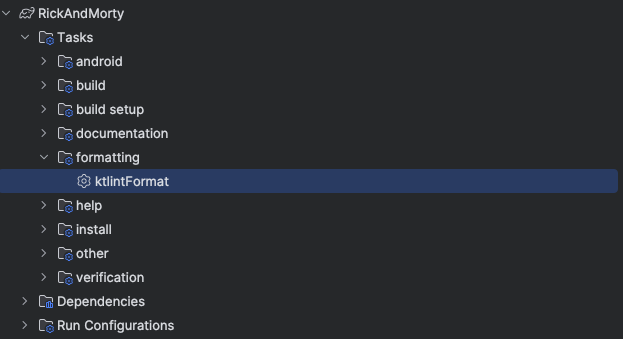

# README.md

## Descripción del Proyecto

Este proyecto es una aplicación Android que utiliza la API de "Rick and Morty" para mostrar información sobre los personajes. La arquitectura empleada es MVVM (Modelo-Vista-ViewModel) y sigue los principios de Clean Architecture, lo que permite mantener un código limpio, modular y de fácil mantenimiento.

## Estructura del Proyecto

El proyecto se divide en tres módulos:

1. **Módulo Core**
- Este módulo es el corazón de la aplicación. Aquí se realiza la comunicación con la API de Rick and Morty utilizando Retrofit.
   - La información obtenida de la API se guarda localmente utilizando Room, permitiendo así un acceso más rápido y eficiente a los datos.
   - Se implementa un repositorio que actúa como una interfaz entre el módulo Core y el módulo principal. Esto permite una separación clara de responsabilidades y facilita las pruebas unitarias.
-   

2. **Módulo Styles**
- Este módulo contiene todos los componentes reutilizables de UI. Aquí se definen estilos, temas y componentes de interfaz que se pueden utilizar en el módulo principal.
   - Al centralizar los estilos, se asegura la consistencia visual a lo largo de la aplicación y se facilita el mantenimiento y la escalabilidad del diseño.
   -   

3. **Módulo Principal**
- Este módulo es donde se implementa la lógica de la interfaz de usuario y la interacción con el usuario.
   - Se utiliza el patrón MVVM para separar la lógica de negocio de la interfaz de usuario. Los ViewModels manejan la lógica, mientras que las actividades y fragmentos se encargan de la presentación.
   - Se siguen los principios de Clean Code, lo que implica que el código es legible, bien estructurado y fácil de entender. Se enfatiza la importancia de las buenas prácticas de programación, como la creación de funciones cortas y la reducción de la complejidad ciclomática.
-   

## KtLint

### ¿Cómo usar KtLint en este proyecto?

Este proyecto está configurado para usar KtLint a través de tareas de Gradle. A continuación, se describen los pasos para verificar y formatear el código Kotlin en el proyecto.

#### 1. Verificar el estilo de código

Para verificar el estilo de código y encontrar violaciones de las reglas de KtLint, puedes ejecutar la siguiente tarea de Gradle:

```bash  
./gradlew ktlintFormat
```  

O de hacerlo de forma manual, puede ingresar al menú de Gradle e ir a la ruta:
Tasks -> formatting -> ktlintFormat

-   

## Decisiones Técnicas

- **Uso de MVVM**: La elección de MVVM permite una separación clara entre la lógica de la aplicación y la interfaz de usuario, lo que resulta en un código más limpio y manejable.

- **Clean Architecture**: Esta arquitectura facilita la escalabilidad y la testabilidad del código al dividir la aplicación en capas bien definidas. Esto permite cambiar la implementación de una capa sin afectar a las demás.

- **Uso de Room para almacenamiento local**: Se eligió Room como solución de base de datos local debido a su simplicidad y su integración con StateFlow, lo que permite que la interfaz de usuario se actualice automáticamente cuando hay cambios en los datos.

- **Retrofit para llamadas a la API**: Retrofit fue seleccionado para manejar las solicitudes de red, debido a su facilidad de uso y su capacidad para convertir automáticamente las respuestas de la API en objetos Java.

- **KtLint**: Es una herramienta de análisis de código y formateo para Kotlin. Ayuda a mantener un estilo de código consistente en tus proyectos Kotlin al aplicar automáticamente las reglas de estilo y convenciones recomendadas.